  

  

  
  
  

---

## 🚀 About me

AI Engineer specialized in **Computer Vision** and **Embedded AI**, from R&D to deployment on embedded targets.

I design real-time vision systems under tight power and compute constraints (**quantization, TensorFlow Lite, ONNX, NPU acceleration**), and I explore **AI agents**, multimodal systems and privacy-first edge AI. Dual Master's degrees in **AI & Visual Computing**.

**Mission:** build robust, efficient and impactful AI that runs where it matters, from cloud to edge.

---

## 🔧 Open Source Contribution

🔹 [**UniCorrn**](https://github.com/neu-vi/UniCorrn), official codebase of the CVPR 2026 paper *"Unified Correspondence Transformer Across 2D and 3D"* (Northeastern University Visual Intelligence Lab, with Adobe Research).

Contributed [**PR #5 (merged)**](https://github.com/neu-vi/UniCorrn/pull/5): lazy loading of optional 3D dependencies and a pure-PyTorch kNN fallback, making the codebase portable to Windows.

`PyTorch · 3D Vision · Correspondence Matching · Open Source`

---

## 🧠 Featured Projects

🔹 [**Smart Vehicle Detector**](https://github.com/Y1D1R/smart-vehicle-detector)
Real-time vehicle detection pipeline combining YOLO-based detection with a Vision-Language Model for fine-grained classification and structured JSON outputs.
 `YOLO · VLM · Real-time CV · Docker`

🔹 [**UNETR 2D Medical Segmentation**](https://github.com/Y1D1R/UNETR-2D-Medical-Image-Segmentation)
From-scratch PyTorch implementation of a 2D variant of the UNETR architecture, with reproducible training and tooling for biomedical datasets.
 `PyTorch · Transformers · Segmentation · Medical AI`

🔹 [**EasyNodule**](https://github.com/Y1D1R/EasyNodule_Fork)
Desktop application for AI-driven pulmonary nodule classification from segmented CT scans, built on a custom CapsNet model with patient management and PDF reports.
 `CapsNet · TensorFlow · Desktop App · Medical AI`

🔹 [**HealthRAG**](https://github.com/Y1D1R/HealthRAG)
Medical chatbot powered by Retrieval-Augmented Generation: PDF ingestion, FAISS vector store, LangChain and a hosted LLM.
 `RAG · LangChain · FAISS · LLM`

---

## 💻 Tech Stack

**Core & Vision**

    

**Edge & Embedded**

   

**LLM & Agents**

      

**MLOps & Data**

        

---

<em>"AI isn't just about intelligence: it's about creating systems that serve and empower people."</em>

  

